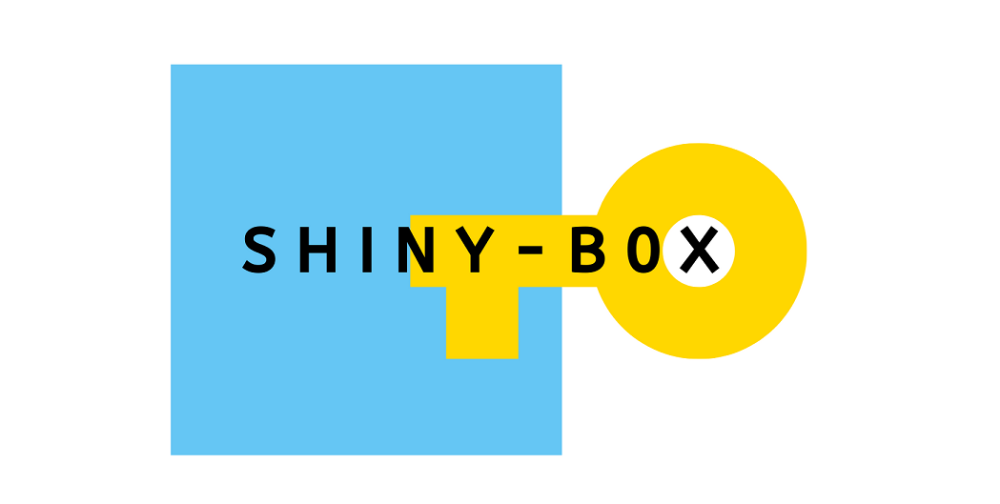

# Shiny-Box

Collection of frequently asked (and more advanced) shiny features in a box. This project is still under continuous development.

Link-Shiny: https://nabiilahardini.shinyapps.io/Shiny-Box

## Changelog:

**3/7/2020**

* navigation bar layout
* displaying image

**16/10/2020**

* tidy paragraph + link with HTML tags
* friendly error with `validate()`
* action & reset button
* using `evenReactive()` and `observeEvent()` after action/reset button
* create dynamic UI based on inputs with `renderUI()`, `insertUI()`, and `removeUI()`
* reactive outputs based on leaflet `input$map_marker_click`
* render gauge from `ECharts2Shiny` package
* customized page length & scrollable `dataTableOutput()`
